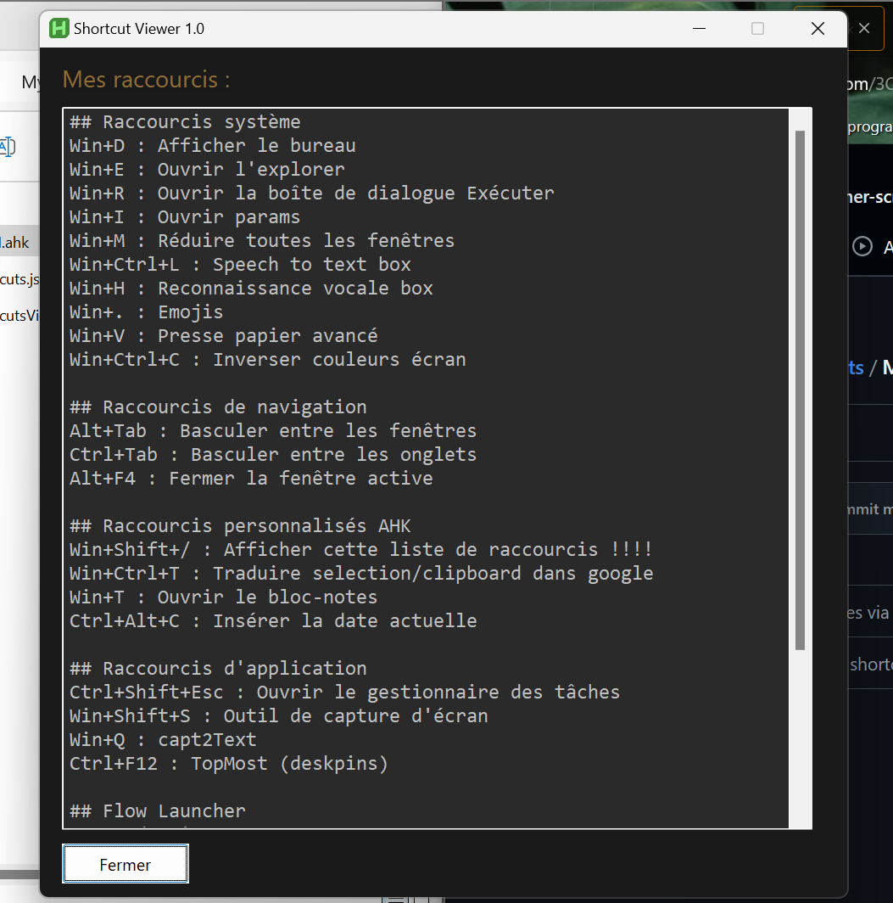

# Personal-Optimisations-in-Windows  
  
## Folder AutoHotkey

Important: All scripts are run from `shortcutsViewer.ahk`

### Shortcuts Viewer

Shortcut: `Win+Shift+/` Open the shortcuts viewer window. You can enter/edit your shortcuts. Saved on close. See picture below.
    
All other ahk scripts below are run from it, so you only need to load this file: `AutoHotkey\Shortcuts viewer\shortcutsViewer.ahk`.  (I don't like to have tones of ahk to load...)  
You can see them at the top of the file. edit it if needed.
```
#Include Personal_shortcuts/personalShortcuts.ahk
#Include Translate_in_browser/translateInBrowser.ahk
#Include TTS/TTS.ahk
```
  



#### Text-to-Speech (ahk)

`Win+Y`: Start/Stop TTS on Selection or Clipboard, anywhere in Windows. I'm using a French(Microsoft Paul) and English(Microsoft Mark) voice in the script. 
N.B: the script is normally registering missing voices in registry. For instance Paul by default is not registered.  
you can double click `AutoHotkey\Shortcuts viewer\TTS\seeInstalledVoices.ahk` to see your installed voices.
  
#### Translate in Browser (ahk)

`Ctrl+Win+T` : Script to translate selection or clipboard, anywhere in Windows, in your browser with google translation. 

### Personal_Shortcuts (ahk)

I create only 1.  
`Win+Shift+g` : query Google from selection or clipboard, anywhere in Windows.

## Folder Toggle_WIFI
  
run `Toggle_WIFI\exe ps1.bat`  
I recommand to create a shortcut on desktop.  
Sometimes without reason your connection can be cut. This a fast way to **restart** it or just to **switch** it.

## Folder Transcription_python
  
To obtain the transcription of videos on Odysee and YouTube in English and French.  
Copy the link of the video into the clipboard, then run the batch `Transcription_python\transcritption_files\transcript.bat`.  
Personally, I run the batch from Flow Launcher with the shortcut t.  
You must install FFmpeg, generally in C:\ and create an environment variable for the path. The other modules are checked at startup and installed if they are not already. The first time it takes a little longer (1 or 2 min)  

The Whisper transcription models vary in size and precision. Choose a model according to the resources available: 

    Tiny : ~39 MB, ~1 GB RAM
    Base : ~74 MB, ~1.5 GB RAM
    Small : ~244 MB, ~2.8 GB RAM (model enabled in the script)
    Medium : ~769 MB, ~5.5 GB RAM
    Large : ~1.55 GB, ~10 GB RAM

How to change the model: In the code of the file transcription_script.py, replace whisper.load_model("small") with the desired model, for example whisper.load_model("medium").

    Lightweight models (Tiny, Base) : Ideal for machines with little RAM.
    Larger models (Small, Medium, Large) : Offer better accuracy, but require more RAM and, ideally, a GPU.

The text files *.txt are saved in the folder `Transcription_python`. Use the reader in the folder Liseuse_HTML_de_txt for a more readable version. ↓↓


## Folder Liseuse_HTML_de_txt

To display the text files in a more readable format in your browser. And it allows you to use certain browser extensions (In private mode).

Method 1: You can paste the HTML file alone anywhere and launch it by double-clicking. It will then be sufficient to select the desired file to be displayed.

Method 2: Add to the context menu of Windows. You need to save the folder somewhere with all the files.


Steps to add a batch file to the context menu via the Windows Registry

Open the Registry Editor :  
    Press Windows + R to open the "Run" dialog box.
    Type regedit and press Enter to open the Registry Editor.

Navigate to the Registry key :  
    Go to the key HKEY_CLASSES_ROOT\*\shell. The * character indicates that the modification will apply to all file types.

Create a new key:  
    Right-click on the shell key.
    Select New > Key.
    Name this key according to your choice, for example, LiseuseTxtHtml.

Add a command under the new key :  
    Right-click on the key you just created (LiseuseTxtHtml).
    Select New > Key and name it command.

Set the path of the batch file :  
    Click on the command key.
    In the right pane, double-click on (Default) to modify its value.
    Enter the full path of the batch file, using the format :
    C:\Users\<username>\Documents\optimisations_perso\Liseuse_HTML_de_txt\liseuse.bat "%1"

    The "%1" is a parameter that represents the selected file in the context menu.

Close the Registry Editor :  
    Once you have set the command, close the Registry Editor.

Test the context menu :  
    Right-click on any file in Windows Explorer.
    You should now see the option you added, which will execute your batch script with the selected file as a parameter.

Administrative rights :  
    To make changes to the Registry, you must have administrator privileges
